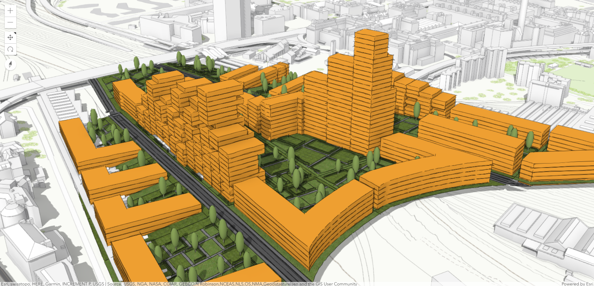
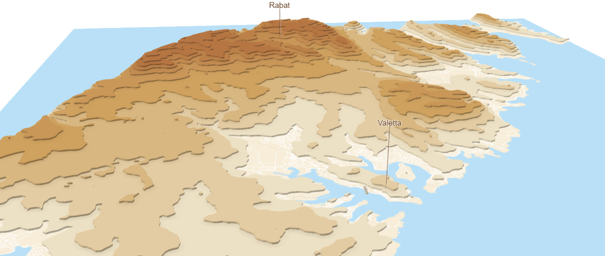
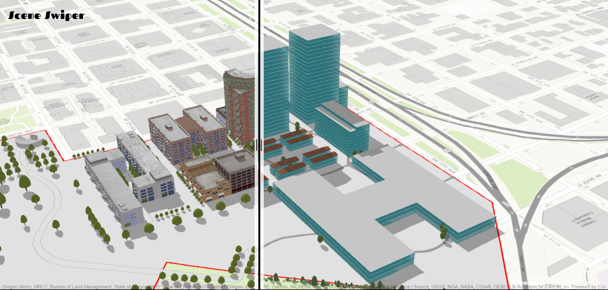
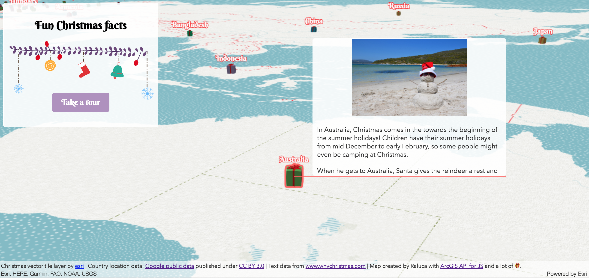
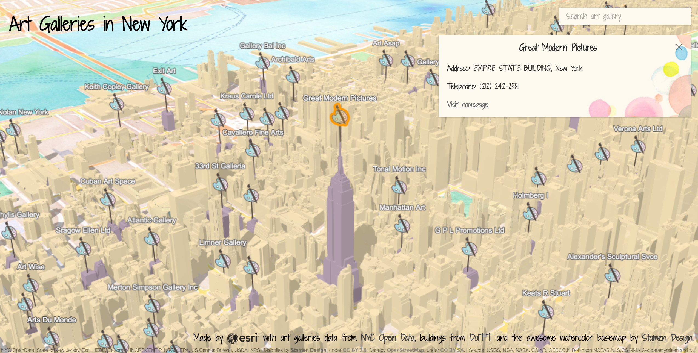

# Urban development in Boston

Orange buildings represent urban projects in development

**View the live app**: [Urban development](./urban-development/)

**Technologies used**:

- ArcGIS Pro & CityEngine for publishing the data
- SceneViewer for creating the webscene
- ArcGIS API for JavaScript for creating the app

**Original data**:

- [Boston Planning and Development Agency (BPDA) 3D building models](http://www.bostonplans.org/3d-data-maps/3d-smart-model/3d-data-download)

# A Holistic Approach to Building 3D Web Apps session demo (DevSummit 2018)

**View the live app**: [Indicity](./indicity/)

**Technologies used**:

- ArcGIS Pro for publishing the data
- SceneViewer for creating the webscene
- ArcGIS API for JavaScript for creating the app

**Original data**:

- [NYC Open Data - Art Galleries](https://data.cityofnewyork.us/Recreation/New-York-City-Art-Galleries/tgyc-r5jh/data) provided by [DoITT](http://www1.nyc.gov/site/doitt/index.page)
- [NYC building data](http://www1.nyc.gov/site/doitt/initiatives/3d-building.page) provided by [DoITT](http://www1.nyc.gov/site/doitt/index.page)

# Malta in contour lines

Displaying Malta's elevation only using contour lines.

**View the live app**: [Malta in contour lines](./malta-contour-lines/)

**Technologies used**:

- ArcGIS Pro for publishing the contour lines
- ArcGIS API for JavaScript for data visualization

**Data**:

- contour lines from [OpenDEM](http://www.opendem.info/download_contours.html).

# Scene Swiper

This app displays two scenes and allows user to switch between them
by swiping.

**View the live app**: [Scene Swiper](./scene-swiper/)

**Technologies used**:

- ArcGIS Pro for publishing the webscenes
- ArcGIS API for JavaScript for data visualizations

# Fun Christmas facts

This app shows Christmas traditions in different countries around the world.

**View the live app**: [Fun Christmas facts](./christmas-map/)

**Technologies used**:

- Blender for creating the 3D models 🎁
- ArcGIS Pro for publishing the models as webstyles
- Inkscape for creating the illustrations
- ArcGIS API for JavaScript for data visualization
- Redux for app state management

**Original data**:

 - Christmas vector tile layer by <a href='http://www.arcgis.com/home/item.html?id=dfcb45f8a2ad4b58a1a7547188a0a00cesri' target='_blank'>esri</a>
 - Country location data: <a href='https://developers.google.com/public-data/docs/canonical/countries_csv' target='_blank'>Google public data</a> published under <a href='https://creativecommons.org/licenses/by/3.0/' target='_blank'>CC BY 3.0</a>
 - Text data from <a href='https://www.whychristmas.com/cultures/' target='_blank'>www.whychristmas.com</a>
 - Various sources for images mentioned in the popup.

# Art galleries in New York

I found a dataset on art galleries in New York and thought it would be fun to map it. Here's what came out of it:

**Read the blog post**: [ArcGIS Blog](https://blogs.esri.com/esri/arcgis/2017/09/05/mapping-art-in-3d/)

**View the live app**: [Art galleries in New York](./art-galleries-nyc/index.html)

**Technologies used**:

- ArcGIS Pro for data processing and publishing
- ArcGIS API for JavaScript for data visualization

**Original data**:

- [NYC Open Data - Art Galleries](https://data.cityofnewyork.us/Recreation/New-York-City-Art-Galleries/tgyc-r5jh/data) provided by [DoITT](http://www1.nyc.gov/site/doitt/index.page)
- [NYC building data](http://www1.nyc.gov/site/doitt/initiatives/3d-building.page) provided by [DoITT](http://www1.nyc.gov/site/doitt/index.page)
- [Watercolor basemap](http://maps.stamen.com/#watercolor/) provided by [Stamen Design](http://stamen.com/)
