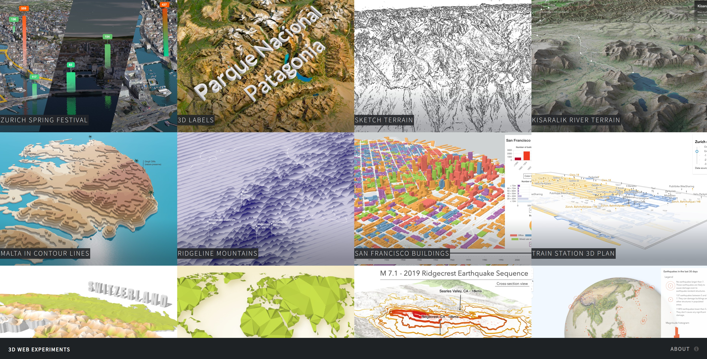

# 3D Web Experiments

This repository holds the source code of many apps made with the [ArcGIS Maps SDK for JavaScript](https://developers.arcgis.com/javascript/).
Want to see them in action, click [here](https://ralucanicola.github.io/JSAPI_demos/) or on the screenshot below.

