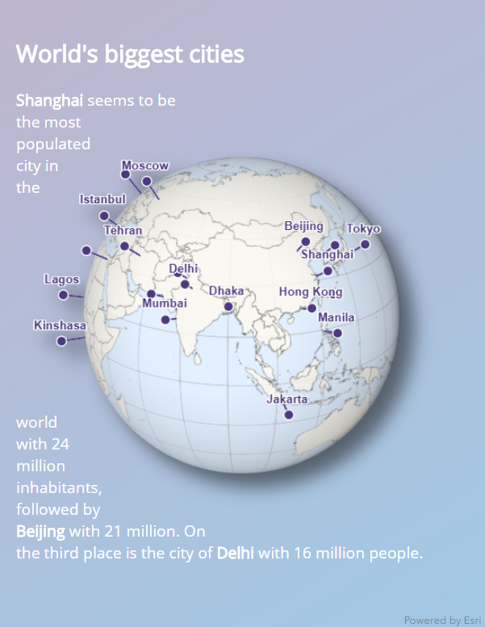
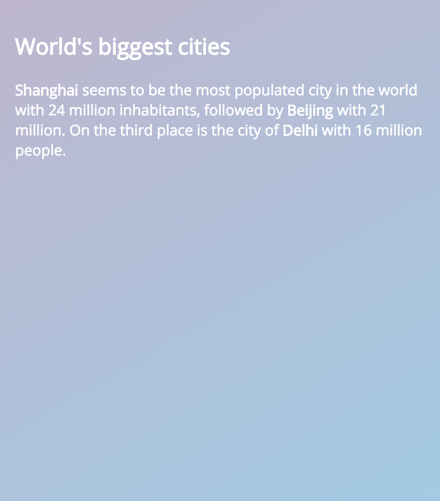
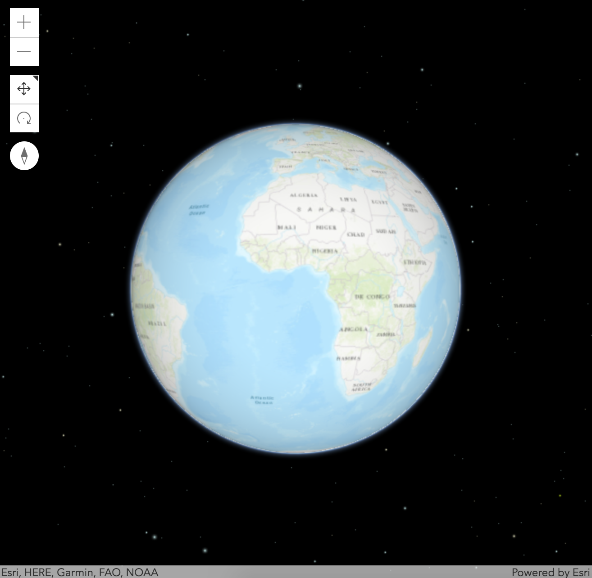
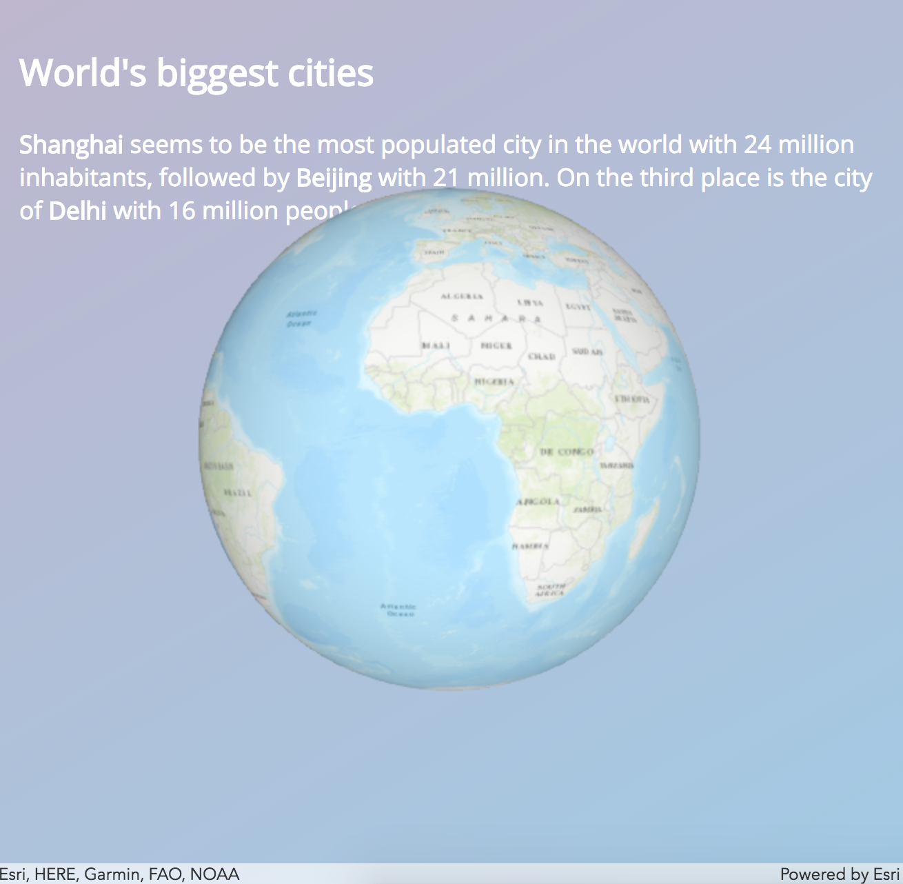
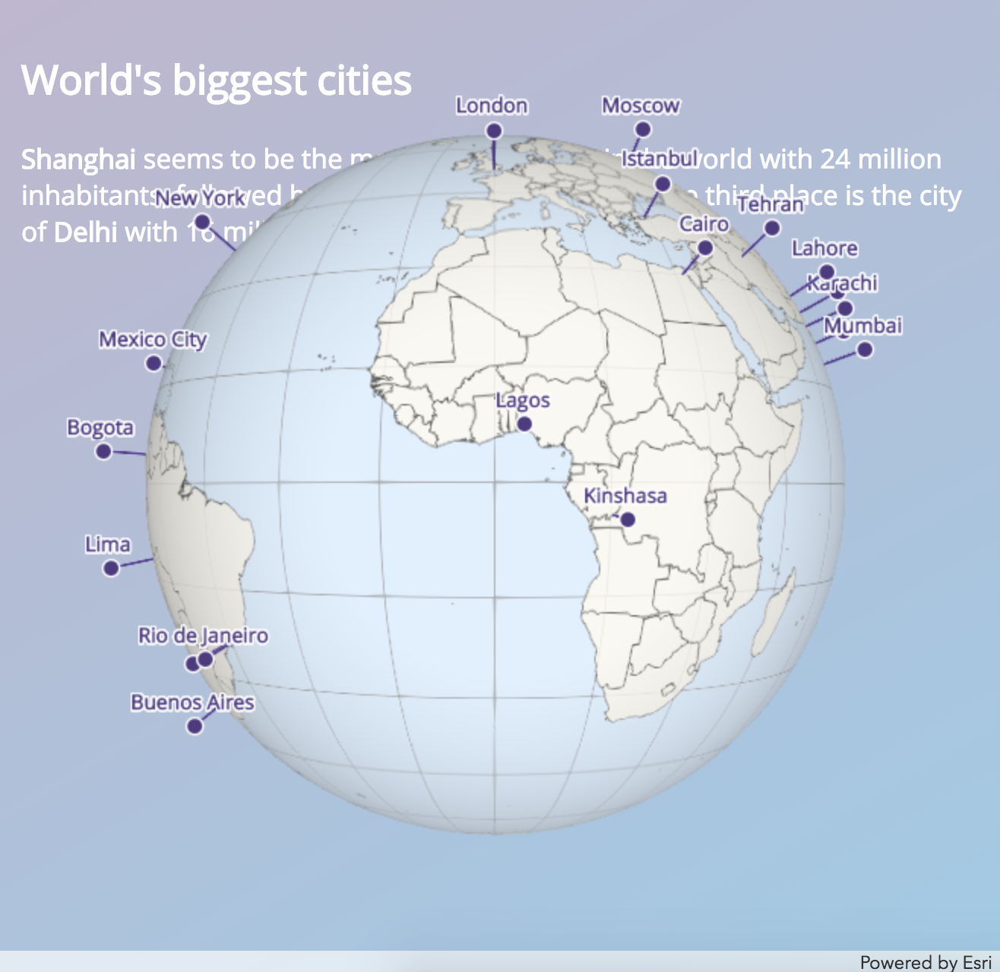

# World's biggest cities - a how-to guide

The app in this folder shows the most populated cities in the world on a globe:

[](https://ralucanicola.github.io/JSAPI_demos/cities-globe/)

You can also view it live [here](https://ralucanicola.github.io/JSAPI_demos/cities-globe/).

This is a step by step tutorial on how to build this app using [ArcGIS API for JavaScript](https://developers.arcgis.com/javascript/):

- [Step 1: the one with the initial setup](#step-1)
- [Step 2: the one where we create the globe 🌐 (as a JS module 😎)](#step-2)
- [Step 3: the one where we make the space disappear ✨](#step-3)
- [Step 4: the one where we populate the 🌎 with countries and cities](#step-4)
- [Step 5: the one with the small details that make the big difference](#step-5)

*Disclaimer: I mostly wrote this tutorial for map makers who are eager to get started with the web.*

## Step 1

### - the one with the initial setup -

As usual with web things, it all starts with an `index.html` file where we import the ArcGIS API for JavaScript and we create the structure of the app:

```html
<!DOCTYPE html>
<html>
<head>
  <meta charset="utf-8">
  <meta name="viewport" content="initial-scale=1">
  <title>World's biggest cities</title>
  <link rel="stylesheet" href="https://js.arcgis.com/4.8/esri/css/main.css">
  <link rel="stylesheet" href="custom.css">
  <script src="https://js.arcgis.com/4.8/"></script>
</head>

<body>
  <header>
    <div id="floating-text">
      <h2>World's biggest cities</h2>
      <p><span>Shanghai</span> seems to be the most populated city in the world with 24 million inhabitants,
        followed by <span>Beijing</span> with 21 million.
        On the third place is the city of <span>Delhi</span> with 16 million people. </p>
    </div>
  </header>
  <div id="view"></div>
</body>
</html>
```

We also load a custom css file where we format the header, the web scene view and add a nice gradient to the background of the html.

We import a font from Google Fonts for the html text. Later on we'll also use it for the city labels in the web scene.

```css
@import url('https://fonts.googleapis.com/css?family=Open+Sans');

html, body {
  padding: 0;
  margin: 0;
  height: 100%;
  width: 100%;
  /* fallback for browsers that don't support background gradients */
  background: #a2c9e5;
  background: linear-gradient(150deg, #beb5ce, #a2c9e5) no-repeat;
}

#view {
  height: 100%;
  width: 100%;
}

header {
  position: absolute;
  top: 0;
  right: 0;
  height: 100%;
  width: 100%;
}

#floating-text {
  font-size: 1.1em;
  text-align: left;
  padding: 20px;
  font-family: 'Open Sans', sans-serif;
  color: #ffffff;
}

span {
  font-weight: bold;
}
```

At the end of this step we have the web page set up like this:



## Step 2

### - the one where we create the globe :globe_with_meridians: (as a JS module :sunglasses:) -

In this step we'll add the web scene with the globe visualization. We could create a new `js` file and load it in a `script` tag, but let's add it as a module instead. Dojo uses the AMD module system and it needs to know where to load the modules from, so we need to specify that in `dojoConfig`:

```html
<script>
  var dojoConfig = {
    // here we specify what modules/packages should be loaded
    packages: [{
      name: "app",
      // app is a folder that we'll create to host our own modules
      location: location.pathname.replace(/\/[^/]+$/, "") + "app"
    }],
    // loading packages asynchronously assures faster loading time
    async: true
  };
</script>
<!-- dojoConfig should be defined before loading the API -->
<script src="https://js.arcgis.com/4.8/"></script>
```

>Side note:

>This is all you need to know about the dojo module loader configuration, but in case you're interested you can read more about it [here](https://dojotoolkit.org/documentation/tutorials/1.10/dojo_config/index.html). I think it's more useful to read about JavaScript modules and their evolution. [This article](https://medium.freecodecamp.org/javascript-modules-a-beginner-s-guide-783f7d7a5fcc) is great in explaining the different ways of loading modules in JavaScript.

Back on track: now we can create an `app` folder and add a `main.js` file where we'll write the code to add the globe. For this small app, a separate folder is a bit of an overkill, but as soon as your app will grow you can add more modules (aka JavaScript files) in the `app` folder.

Now in main.js we'll create a web scene and a view:

```js

// we use define instead of require when we create a module
define([
  "esri/WebScene",
  "esri/views/SceneView",
  "esri/layers/FeatureLayer",
  "esri/layers/support/LabelClass"
], function (WebScene, SceneView, FeatureLayer, LabelClass) {

  // the module exports an object with an init method
  // init creates the web scene and the view
  return {

    init: function() {

      // the web scene is the data model: it contains the basemap, the ground and the layers
      const webscene = new WebScene({
        basemap: "topo"
      });

      // the view is the visual representation of the web scene
      const view = new SceneView({
        container: "view",
        map: webscene
      });

      // setting the view as a global object is useful for debugging
      window.view = view;

    }
  }
});
```

One more thing: our module isn't loaded yet. We also need to import the module in our app, so in the html file add one more script before the closing body tag:

```html
<script>
  // this loads the main module and runs the init method
  require([
    "app/main",
    "dojo/domReady!"
  ], function(app) {
      app.init();
    });
</script>
```

And this is what our web scene currently looks like. I know what you're thinking: where is my nice background? :scream: Don't worry, we'll get it back in the next step.



## Step 3

### - the one where we make the space disappear :sparkles: -

Ok, let's get rid of the realistic dark space behind our globe so that we can see the web page background. This all happens in the [environment](https://developers.arcgis.com/javascript/latest/api-reference/esri-views-SceneView.html#environment) of the view.

First we need to enable transparency on the view by setting [alphaCompositingEnabled](https://developers.arcgis.com/javascript/latest/api-reference/esri-views-SceneView.html#alphaCompositingEnabled) to `true`.

Next we want to set the background of the view to be transparent. As the view background is behind the stars and the atmosphere we also need to remove them:

```js
environment: {
  background: {
    type: "color",
    color: [0, 0, 0, 0]
  },
  starsEnabled: false,
  atmosphereEnabled: false
}
```

To remove the navigation widgets I usually just remove everything in the `view.ui` in the top left corner like this:

```js
view.ui.empty("top-left");
```

Alrighty, by now your code should look like this:

```js

const webscene = new WebScene({
  basemap: "topo"
});

const view = new SceneView({
  container: "view",
  map: webscene,
  alphaCompositingEnabled: true,
  environment: {
    background: {
      type: "color",
      color: [0, 0, 0, 0]
    },
    starsEnabled: false,
    atmosphereEnabled: false
  }
});

view.ui.empty("top-left");
```

So now if you check your app, this is what you should see:



## Step 4

### - the one where we populate the :earth_americas: with countries and cities -

We want to display the biggest cities as points. There's no need for a detailed basemap, we only need the borders of the countries.

So we'll remove the basemap and give the ground a blue [surfaceColor](https://developers.arcgis.com/javascript/latest/api-reference/esri-Ground.html#surfaceColor), like this:

```js
const webscene = new WebScene({
  basemap: null,
  ground: {
    surfaceColor: [226, 240, 255]
  }
});
```

Next, we need to add data. In the Living Atlas there's a dataset with generalized borders of the countries: https://www.arcgis.com/home/item.html?id=2b93b06dc0dc4e809d3c8db5cb96ba69

We'll load it as a [FeatureLayer](https://developers.arcgis.com/javascript/latest/api-reference/esri-layers-FeatureLayer.html) in our app and apply a [SimpleRenderer](https://developers.arcgis.com/javascript/latest/api-reference/esri-renderers-SimpleRenderer.html) to it:

```js
const countryBoundaries = new FeatureLayer({
  url: "http://services.arcgis.com/P3ePLMYs2RVChkJx/arcgis/rest/services/World_Countries_(Generalized)/FeatureServer",
  title: "World Countries",
  // we use a simple renderer when we want to symbolize all features with the same symbol
  renderer: {
    type: "simple",
    symbol: {
      type: "polygon-3d",
      symbolLayers: [{
        type: "fill",
        material: { color: [255, 250, 239, 0.8] },
        outline: {
          color: [70, 70, 70, 0.7]
        }
      }]
    }
  }
});

// then we add the layer to the web scene
// I use the addMany method because we'll add some more layers later
webscene.addMany([countryBoundaries]);
```

Let's add the points for the cities as well. Again, there's an item in the Living Atlas with world cities as points: https://www.arcgis.com/home/item.html?id=6996f03a1b364dbab4008d99380370ed

We create another [FeatureLayer](https://developers.arcgis.com/javascript/latest/api-reference/esri-layers-FeatureLayer.html) and we only want to see the biggest cities, so we're going to set a [definitionExpression](https://developers.arcgis.com/javascript/latest/api-reference/esri-layers-FeatureLayer.html#definitionExpression) to filter out cities that have a population under 6 million.

```js
const populationLayer = new FeatureLayer({
  url: "https://services.arcgis.com/P3ePLMYs2RVChkJx/arcgis/rest/services/World_Cities_analysis/FeatureServer",
  definitionExpression: "POP > 6000000"
});

// don't forget to add it to the web scene
webscene.addMany([countryBoundaries, populationLayer]);
```
To style the layer we still use a [SimpleRenderer](https://developers.arcgis.com/javascript/latest/api-reference/esri-renderers-SimpleRenderer.html) (all my points will look the same), but we're going to 3D-ify it a little by [lifting the points up vertically](https://developers.arcgis.com/javascript/latest/api-reference/esri-symbols-PointSymbol3D.html#verticalOffset) and connecting them to the original location using [callouts](https://developers.arcgis.com/javascript/latest/api-reference/esri-symbols-callouts-LineCallout3D.html).

The code looks like this:
```js
populationLayer.renderer: {
  type: "simple",
  symbol: {
    type: "point-3d",
    symbolLayers: [{
      type: "icon",
      size: 8,
      resource: { primitive: "circle" },
      material: { color: "#4c397f" },
      outline: {
        size: 1,
        color: "white"
      }
    }],
    verticalOffset: {
      screenLength: 20
    },
    callout: {
      type: "line", // autocasts as new LineCallout3D()
      size: 1.5,
      color: "#4c397f"
    }
  }
};
```
We also add labels using the font that we imported in the css file.
```js
populationLayer.labelingInfo = [
  new LabelClass({
    labelExpressionInfo: { expression: "$feature.CITY_NAME" },
    symbol: {
      type: "label-3d",
      symbolLayers: [{
        type: "text",
        material: { color: "#4c397f" },
        size: 10,
        font: {
          family: "Open Sans",
          weight: "bold"
        },
        halo: {
          color: "white",
          size: 1
        }
      }]
    }
  })
];
```

For a nicer globe effect we'll add a graticule. This is a layer that I generated using the [Create Fishnet](http://pro.arcgis.com/en/pro-app/tool-reference/data-management/create-fishnet.htm) tool in ArcGIS Pro.

```js
const graticule = new FeatureLayer({
  url: "https://services.arcgis.com/V6ZHFr6zdgNZuVG0/arcgis/rest/services/World_graticule_15deg/FeatureServer",
  opacity: 0.8
});
webscene.addMany([graticule, countryBoundaries, populationLayer]);
```
By now our map should look like this:



## Step 5

### - the one with the small details that make the big difference -

Let's focus the camera on the cities that are most populated: Shanghai, Beijing and Delhi. What I usually do is to navigate to the position I find good as initial viewpoint and then print the camera to the console. Then I add it to the view.

```js
camera: {
  position: {
    spatialReference: {
      wkid: 4326
    },
    x: 94.28248677690586,
    y: 21.553684553226123,
    z: 25000000
  },
  heading: 0,
  tilt: 0.12089379039103153
}
```

The day time also needs some adjustment, so we'll specify the date in the `environment.lighting`:
```js
lighting: {
  date: "Sun Jul 15 2018 15:30:00 GMT+0900 (W. Europe Daylight Time)"
},
```

It's not very useful to let the user zoom in too much, so we'll set an altitude constraint on the view:

```js
constraints: {
  altitude: {
    min: 18000000,
    max: 25000000
  }
}
```

Let's spice up that 3D effect with some shadows. I recently discovered that [drop-shadow()](https://developer.mozilla.org/en-US/docs/Web/CSS/filter-function/drop-shadow) CSS filter works really nice with the transparency on the view. Such that my globe and all points/labels can cast shadows on the background. For this, add the filter on the view:

```css
#view canvas{
  filter: drop-shadow(16px 16px 10px rgba(0,0,0, 0.5));
}
```

One more thing that you probably noticed in the beginning: we can't read the text. Let's make a trick to make it nicely wrap around the globe.

The trick goes like this: we add a `div` with a circle shape inside the header. Then we make the text float around it.

```css
#circle {
  height: 100%;
  width: 100%;
  shape-outside: circle(30%);
  float: right;
}
```

Unfortunately creating a circle div is only easy in Chrome, where `shape-outside` property is already implemented. For the rest of the browsers I added [this polyfill from Adobe](https://github.com/adobe-webplatform/css-shapes-polyfill).

And there we go, this is the final globe :tada:

