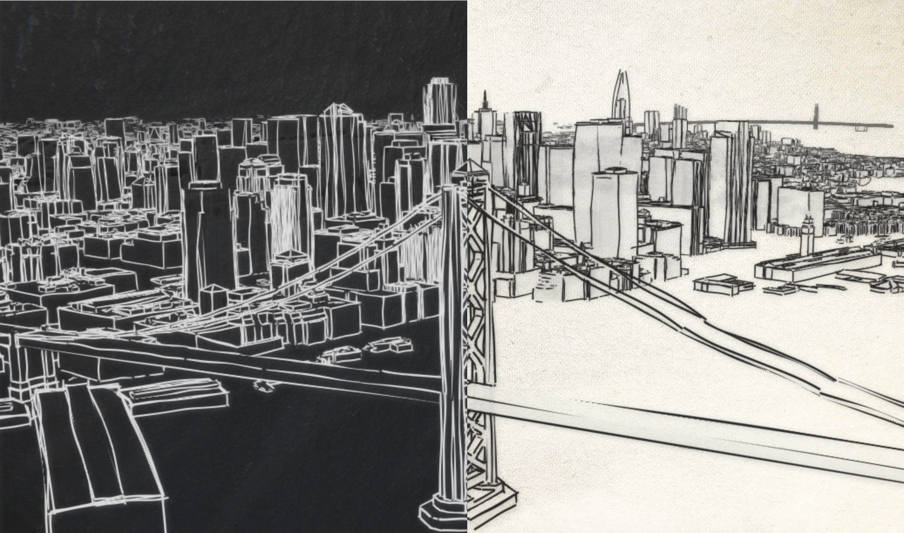
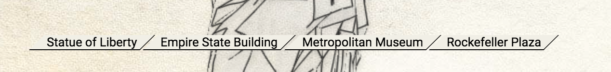

# Sketch the city

Displays different cities as a hand drawn 3D sketch. There are 2 styles available: chalk on blackboard and pencil on canvas. Here are the 2 styles applied on a webscene of San Francisco:

**Inspiration**: [John Nelson](https://twitter.com/John_M_Nelson) showed me this [awesome project](https://www.sketchnthecity.com/) and we were wondering whether we could create a similar effect using the [sketch edges](https://developers.arcgis.com/javascript/latest/api-reference/esri-symbols-edges-SketchEdges3D.html) feature of the ArcGIS API for JavaScript. This project is what came out.

**How it works**: The API loads a [WebScene](https://developers.arcgis.com/javascript/latest/api-reference/esri-WebScene.html) of a city created in the [SceneViewer](https://www.arcgis.com/home/webscene/viewer.html).
In this app a new WebScene is created where all the other layers are droped except the SceneLayers with the buildings. The SceneLayers have a renderer that shows the edges with a sketch line and the faces are semi-transparent. The [SceneView](https://developers.arcgis.com/javascript/latest/api-reference/esri-views-SceneView.html) that displays the WebScene has a transparent [background](https://developers.arcgis.com/javascript/latest/api-reference/esri-webscene-background-ColorBackground.html), so that an image of an old canvas or a blackboard can be seen behind it.

**How can I add my own city**:

Do you have a 3D model of your city?

  - Yes -> Here's a step by step tutorial on how to visualize it in this app:
    - **Step 1**: Publish it as a SceneLayer using ArcGIS Online, ArcGIS Pro or CityEngine. See this awesome blog post by [Russ](https://twitter.com/rssllrbrts) that explains the different ways to publish SceneLayers -> [How to publish Scene Layers in ArcGIS Online](https://www.esri.com/arcgis-blog/products/arcgis-online/3d-gis/how-to-publish-scene-layers-in-arcgis-online/). Focus only on the 3D Object SceneLayers, we don't use PointClouds, Integrated Mesh or Point SceneLayers in this app.
    - **Step 2**: Go to [SceneViewer](https://www.arcgis.com/home/webscene/viewer.html) and create a webscene using the layer you just published. If you've never used SceneViewer, here's a short tutorial on [how to create a WebScene](https://developers.arcgis.com/labs/arcgisonline/create-a-web-scene/). You can create a few slides of the major city attractions and give them a title. They will show up like this:

    
    - **Step 3**: Once you save the webscene it gets an id, that you can see in the url of the SceneViewer. Take that id and set it as an id in the query parameter of this application. For example, if I want to load a webscene with the id of `9eea926653b84bc093760d4b08d84190` then I would load the application like this: https://ralucanicola.github.io/JSAPI_demos/sketch-the-city/index.html?id=9eea926653b84bc093760d4b08d84190
    - **Alternative Step 3: I actually want my city to appear in the menu of cities in this app**:
      - Long version: fork this repo and add the city name, webscene id and optionally an attribution in the [cities.json](cities.json) file. Submit a Pull request and I'd be happy to merge it in my app 😃
      - Short version: just send me the webscene id and I'll add it.

  - No -> Search in the [Living Atlas](https://livingatlas.arcgis.com/en/) and maybe you can find a layer that is published for your city. Once you find it go to step 2 in the instructions above.

**I have this awesome idea for a new style**:

Please, pretty please, submit a PR with your style 🤩 or just write to me :)