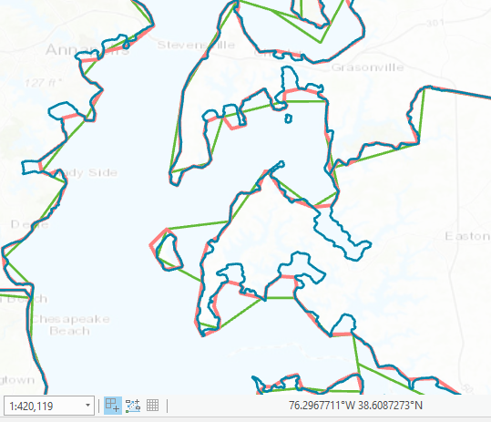
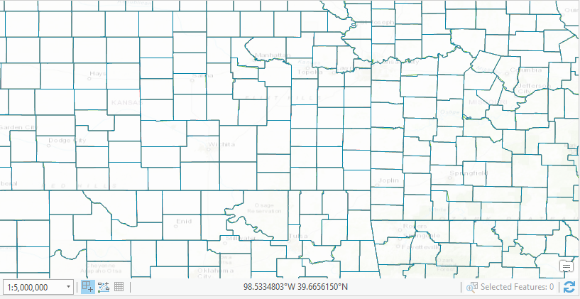
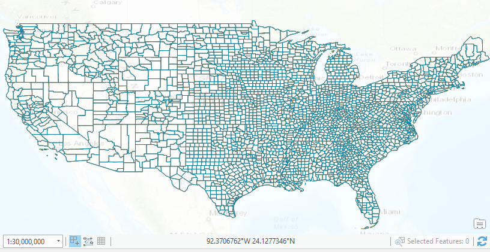

# Creating a choropleth map of unemployment in the US

- [Purpose of the map](#purpose-of-the-map)
- [The data](#the-data)
- [Map design](#map-design)
- [Webby requirements](#webby-requirements)

# Purpose of the map

This map shows the evolution of unemployment rate in the US, from 1990 to 2018. An interactive map on this time period at county level doesn't exist yet. This map is aimed at anybody interested in the topic. The audience is very broad so it should be easily read and understood by anyone.

## The data

### What data exactly will be displayed

Per definition, **unemployment rate** is the number of unemployed people as a percentage of the labour force, where the latter consists of the unemployed plus those in paid or self-employment. Unemployed people are those who report that they are without work, that they are available for work and that they have taken active steps to find work in the last four weeks.

### What are the raw sources of the data

The Bureau of Labor Statistics has data on labor force available at: https://www.bls.gov/lau/#cntyaa. Data for the US for all the counties from 1990 to 2017 is available: Labor force, employed, unemployed and rate. We are only interested in the rate that is already calculated as `unemployed/labor force * 100`.

The geographic data for the counties can be found at:
https://www.census.gov/geo/maps-data/data/cbf/cbf_counties.html

And the geographic data for the states can be found at:
https://www.census.gov/geo/maps-data/data/cbf/cbf_state.html

### Licenses for the data

to do

### Generalization level

This is important for 2 reasons:

 1. The detail level of a dataset needs to be adjusted to the scale of the map, so that the user understands the data and can easily orient himself.
 2. Generalization is important for performance. A smaller number of vertices usually means that the application will perform better.

For this map I could choose between 3 generalization levels:

  - 1: 500,000 - blue border
  - 1: 5,000,000 - red border
  - 1: 20,000,000 (`cb_2017_us_county_20m.shp`) - green border

  

At this scale you can clearly see the difference between the datasets, but we're actually interested in an overview map of the US. So probably the users will navigate in the map somewhere in between 1:5,000,000 and 1:30,000,000, where as you can see below the differences between the datasets aren't visible anymore:




Another metric for choosing the generalization level is performance. The fewer vertices, the better! So let's count them. I'm using a small script that you can run in the Python console in ArcGIS Pro to print how many vertices a layer has:

```py
def getVertexCount(input):
  count = 0
  with arcpy.da.SearchCursor(input, 'SHAPE@') as cursor:
      for row in cursor:
          if (row[0].type == "point"):
              count += 1
          else:
              count += row[0].pointCount
  print(count)

# and the results for my datasets:

getVertexCount(r'C:\data\USA_counties\cb_2017_us_county_500k.shp')
1040321

getVertexCount(r'C:\data\USA_counties\cb_2017_us_county_5m.shp')
214908

getVertexCount(r'C:\data\USA_counties\cb_2017_us_county_20m.shp')
55906
```

So, the winner is clearly the most generalized dataset the one with data vectorized at 1:20,000,000.

### Other data needed for context information

I want to display also the borders of the states, so I will download and use the 20m dataset for states. Like this, I also make sure that the borders match the borders of the counties.

[State level data](https://www.census.gov/geo/maps-data/data/cbf/cbf_state.html)

### Data normalization

Choropleth maps should never depict absolute values. For this map we will use the unemployment rate, which already is a percentage.

### Data processing

Join of attribute data and geographical data based on id.

Load in unemployment data:

```py
import pandas as pd

#todo: make a unique key from state and county...hopefully that works for the join
data = pd.read_excel(r"C:\Users\rauc8872\Desktop\laucnty17.xlsx", header=None, names=['county_code', 'county_name', 'labor_force', 'employed', 'unemployed', 'rate'],skiprows=[0,1,2,3,4,5], usecols=[2,3,6,7,8,9], skipfooter=3, dtype={'county_code': object}, converters={'unemployed': int, 'labor_force': int, 'employed': int})

# code: https://my.usgs.gov/confluence/display/cdi/pandas.DataFrame+to+ArcGIS+Table
x = np.array(np.rec.fromrecords(data.values))
names = data.dtypes.index.tolist()
x.dtype.names = tuple(names)
arcpy.da.NumPyArrayToTable(x, r'E:\Workspace\testData.gdb\testTable')
```


### Map projection

For a choropleth map it's important to preserve the areas, so we're going to reproject the data in Albers Conic Equal-Area.

## Map design

Choosing the correct map type: choropleth map

### Color scheme

A sequential color scheme for quantitative low-to-high data.

Color blind friendly.

Darker or more saturated hues represent higher values, and lighter or less saturated represent lower values.

Light yellow to dark red/purple.

### Legend

Is it easy to understand?

### Data classification

We will build an interactive map of all the years -> load in all the data and explore it statistically. Have a look at the histogram - is the data in a normal distribution? does it have outliers?
Our purpose with this map is to show patterns in the data. We're not so much interested in distinguishing each single value.
This is why we will use an unclassified choropleth map with several stops at equal interval/quantile/natural breaks.


Good blog posts about this:

- http://uxblog.idvsolutions.com/2011/10/telling-truth.html
- https://blog.datawrapper.de/choroplethmaps/
- https://blog.datawrapper.de/how-to-choose-a-color-palette-for-choropleth-maps/
- https://beta.observablehq.com/@jake-low/how-well-does-population-density-predict-u-s-voting-outcome
- https://www.vis4.net/blog/2011/12/choropleth-maps/

### Choose font, color and style for the UI & map

Font for labels, legend and other elements should be easily legible.

### Location, orientation

### Interactivity

on mouse hover show exact percentage of the data.
user can click on an year and the map will display the data for that year.
user can also click on a play button to let the years play one after another and have a better view of the changes. Layers will smoothly change.

### Figure/ground

The map is only about the US and the bordering countries or geographical areas are not important. There is no basemap, but there is contextual data about the states.

### Supporting information

play with sound generated from statistical data?

### Title/subtitle for the map

### Impressum

Copyrights, information on data sources, when the map was created, by me :)

## Webby requirements

### Device/browser compatibility

It works in IE, Firefox, Chrome and Safari. It works on mobile devices as well (the newest ones).

### Accessibility

ARIA attributes, color blind friendly, easy UI navigation using keyboard, description of what the map represents? (this could be a new cool idea! maybe not so new though...but when something changes in the map, a description of the map is shown...)

### UI design

Should be intuitive, easy to use and responsive
UI components:
- timeline
- title

## Last but not least: get feedback for your map :)


